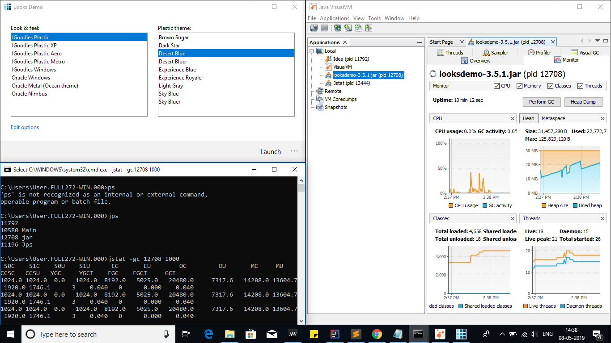

### java memory model

 1. memory management Young Generation
      1. new objects created goes to YG
      1. YG divided into two parts EDEN and TWO SURVIVOR memory spaces
      1.  newly created objects --> Eden , if eden full minor garbage collection 
       is performed 
      1. MinorGC checks survivor objects and move them to Survivor spaces
      1. if the Survivor objects survive many cycle then moved to old gen
     
 1. Memory management in Old gen
    1.contains Long-lived and survived obj after many rounds of minor GC
    1. takes longer time ,Stop the World event
    1. bcause it checks all live objects--> timeout errors (respinsive app)
    1.time depends on strategy used
    1. necessary to monitor and tune GC to avoid timeouts
    
 1. Permanent Generation 
       1. contains application metadata -->that describes class ,methods       
       1. not a part of java heap memory
       1. populated by JVM at runtime 
       1. also contains java SE library classes and methods
       1. only GC ed in full garbage collection
       
 1. Method Area:
       1. part of perm gen 
       1. stores class structures (runtime constants , static variables) , code for methods and constructors
  1. Memory pool
       1. created by JVM memory managers 
       1. pool of immutable objects ex String Pool
       1. it can belong to Heap or Perm Gen depending on JVM manager implementation
  1. Runtime Constant pool             
        1. contains Class runtime constants and static methods
        1. part of tne method area
  1. Java Stack Memory
        1. used for execution of a thread
        1. it contains Method specific values --> short lived and references to other objectd in the heap 
           that are getting reffered
    
### Java heap Memory Switches
    
   1. used to set the memory sizes and their ratios
   1. commonly used memory switches
        1. -Xms  for setting initial heap size when jvm starts
        1. -Xmx  for setting the maximum heap size 
        1. -Xmn   for setting size of Young Generation, rest space goes for old generation
        1. -XX:PermGen  setting size of Perm Gen memory
        1. -XX:SurvivorRatio ratio of Eden and survivor space default=8
            ex Ygenspace = 10MB then XX:SurvivorRatio=2 ---> 5mb eden and 5mb survivor space
        1. -XX:NewRatio for providing ratio of old/new gen sizes ,default = 2
        
### Java Garbage collection    
      automatic garbage collection,      
      Garbage Collector :unreferenced objects are deleted and space is reclaimed           
             1. Marking : identifies unused objs
             2. Normal Deletion : deletes identified and reclaim free space
             3. Deletion with Compacting : compact survived objs together
    Two problems:
       1. most newly created objs  are unused
       2. multiple garbage collection survived obj are also cleared
          so we use generation spaces (Y gen ,old gen)
                   

### perform garbage collection tuning

    commands
        
        1. start app with a particular settings
            
            example: java -Xmx120m -Xms30m -Xmn10m -XX:PermSize=20m -XX:MaxPermSize=20m -XX:+UseSerialGC -jar Java2Demo.jar
        
        2. know the process id in linux or mac
                   
                    ps -eaf | grep java2demo.jar
             
        3. using jstat:   jstat -gc pid 1000
                   
                   jstat -gc 9582 1000
                                        
### java garbage collection tuning
    
    its is the last option to increase throughput of your application
    and only when you see a drop in performance because of longer GC timings causing application timeout.

    tips:
    
    
   1. If you see java.lang.OutOfMemoryError: PermGen space errors in logs, then try to monitor and increase the Perm Gen memory space
      using -XX:PermGen and -XX:MaxPermGen JVM options. You might also try using -XX:+CMSClassUnloadingEnabled and 
      check how it’s performing with CMS Garbage collector.
    
   2. If you see a lot of Full GC operations, then you should try increasing Old generation memory space.Overall garbage collection tuning 
      takes a lot of effort and time and there is no hard and fast rule for that. You would need to try different options and 
      compare them to find out the best one suitable for your application.
          
          
   

#### experimented :

### important links

https://www.journaldev.com/2856/java-jvm-memory-model-memory-management-in-java

###  other key points
    
    find the process id of java application running in windows 
      
            jps 
       or taskmanager
      
     to kill process
        
         TASKKILL /PID %PID%
         
         
           

