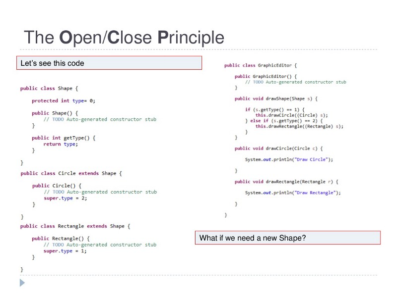

singleton Pattern https://javarevisited.blogspot.com/2014/05/double-checked-locking-on-singleton-in-java.html
Decorator pattern http://www.java67.com/2013/07/decorator-design-pattern-in-java-real-life-example-tutorial.html
Observer Pattern https://javarevisited.blogspot.com/2011/12/observer-design-pattern-java-example.html

interview question
http://www.java67.com/2015/12/top-30-oops-concept-interview-questions-answers-java.html

Ten oops principles 

Udemy course link : https://click.linksynergy.com/fs-bin/click?id=JVFxdTr9V80&subid=0&offerid=562016.1&type=10&tmpid=14538&RD_PARM1=https%3A%2F%2Fwww.udemy.com%2Fbasics-of-software-architecture-design-in-java%2F

1. Dry principle:
     1. donot repeat yourself reduce duplicate code
     1. use abstration to abstract common things 
     1. use public final constant for hardcode variables
     1. you will find this helpful in maintenance
     1. duplication is not for code but for functionality
     
     
1. Encapsulate what changes: 
      1. change is always constant
      2. the principle of making variable and methods by private
          by default and increasing access step by step from private -->protected-->public
      3. the benefit of the oop design principle is that its easy to test and
         maintain proper encapsulated code
         
 
1. Open Closed Design principle:
   
   1. class , methods or functions must be open for extension 
       and closed for modification
   2. Uncle bob book Agile software clean code craftmanship
   3. the key benefit of this oop design principle is that already tried and 
      tested code is not touched which means they wont break.
   
   

Single Responsibility Principle
   1. there should not be one reason for the class to change
      or a class should always handle only single functionality
   2. it reduces tight coupling 
   3. if you put more than one functionality in one class it introduces a coupling between
      the two functionalities .

1. Dependency injection or Inversion principle :
            
                     