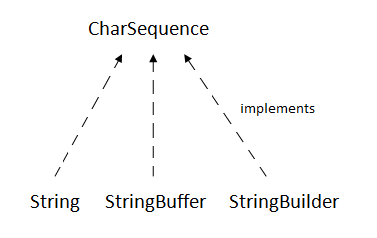

### Java String

 1. String is an object that represents sequences of char values.
      An array of chars also work as java string
             
               char[] cha = { 'j', 'a', 'v', 'a'}
               String s = new String(ch);
               
               // is same as 
               
               String s = "java";
                
                
 
 1.  some methods compare() equals() split() length() replace() compareTo()
   intern() substring() etc
   
 1. java.lang.String implements Serializable , Comparable and CharSequence interfaces
 
 
 CharSequence interface 
               
   
  
      these are the three main class that implement this interface
      
two ways to create string obj:
     
        1. By string literal 
                String s= " welcome";
            each time you create a string literal JVM checks 
              String constant pool if the string already exists
              if exists new string instance is created or else 
              references old instance
                   String s1="mohanteja";
                   String s2= "mohanteja";  // doesn't creates new instance
                
                to make java more memory efficient
                   
                   
 
 
        1. by new keyword
            
            String s = new String("welcome"); // creates two objs and one reference variable
            
            this goes to normal(non -pool) heap memory
             
           
      
      
      
      
      
      
      
      
      
      
      
      